# API Framework

**Table of Contents**

1. [Overview](#1.0)
1. [API Framework Overview](#2.0) 
   1. [Component Architecture](#2.1)
   1. [Object Model](#2.2)
   1. [Where is the framework running today?](#2.3)
   1. [The Future - API Economy](#2.4)
1. [Running API Framwork Test Environment](#3.0)
   1. [Setup](#3.1)
   1. [Database Schema](#3.2)
   1. [Sample APIs](#3.3)
1. [Create API based on Persisted Model](#4.0)
1. [Summary](#6.0)  


<a id="1.0"></a>

## Overview

The API framework started with the GBS Practice Lead and Project Health Dashboards, but it has expanded to be used, in a non-production environment, for WF360 Vortex feed, Chasey Bots, and SCORE; so, I figure it is time to socialize this asset.  The framework was written from the start following a microservice architecture.  Now that it has been deployed in a Docker container on Cirrus running OpenShift, we are poised to deliver a general-purpose API framework that can be used by multiple applications within an API economy, scaling dynamically are required.

This repository contains a self contained sandbox for the API Framework.  You will need version of **Node.js**, which contains **Node Package Manager** (**NPM**).  To get the latest version of Node.js please visit:

[https://nodejs.org/en/download/](https://nodejs.org/en/download/)

By default, the sandbox environment allows you to connect to an instance of Db2 instance IBM Public Cloud and/or a hosted instance of Db2 (BMSIW/SIW with access to a limited set of reference data, see ponessa@us.ibm.com for the credentials).

This sandbox solution includes setting up and running an instance of Db2 in a Docker container and using **Flyway**, also run from a Docker, to create and populate a database schema.  See [https://github.ibm.com/IBM-Services-WFM/flyway-docker-db-migration](https://github.ibm.com/IBM-Services-WFM/flyway-docker-db-migration) which contains detailed instructions for creating this container Db2 enviroenvironment and populating it using Flyway.

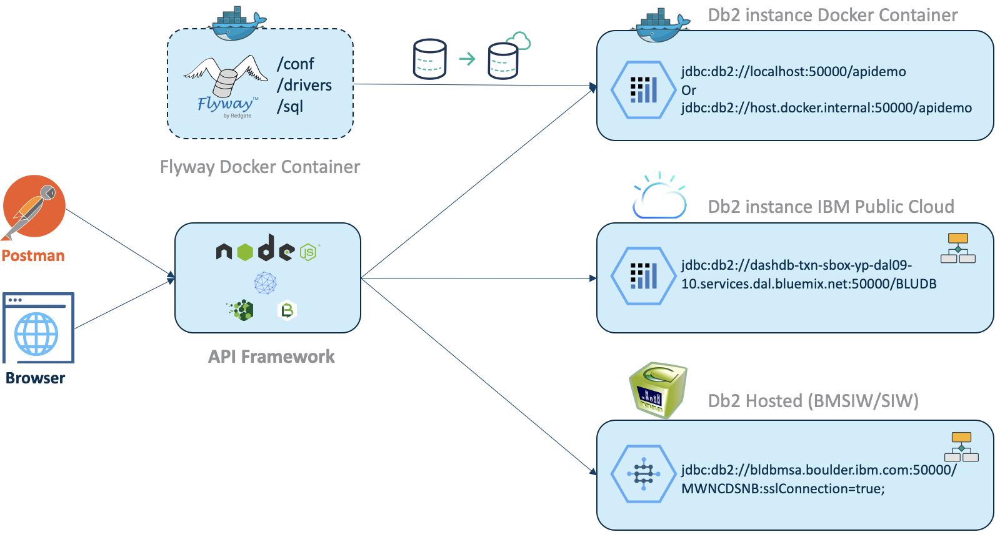

<a id="2.0"></a>

## API Framework Overview

The API framework enables RESTful API to be created and run against backend relational tables with no coding required. The solution is built upon IBM's API Connect product extending it to handle RESTful API to backend sources that require varying attributes in the SELECT clause, row aggregation and consolidation, and joining across multiple tables.

The diagram below shows the underlying technology stack that the framework runs on, specifically ApiConnect, StrongLoop, Loopback, and Node.js.

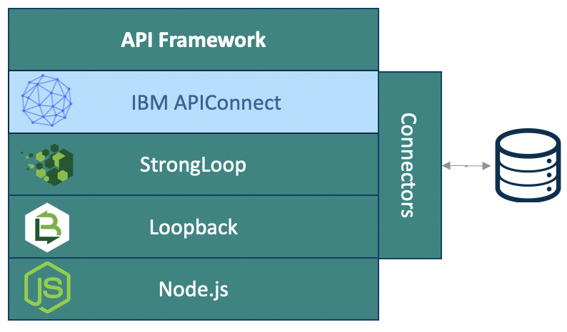

A framework itself is a set of cooperating classes that make up a reusable design for a specific class of software or problem domain. A framework provides architectural guidance by partitioning the design into abstract classes and defining their responsibilities and collaborations. A developer customizes a framework to a particular application through configuration and/or by subclassing and composing instances of framework classes.

The next diagram shows the feature components of the API Framework.  

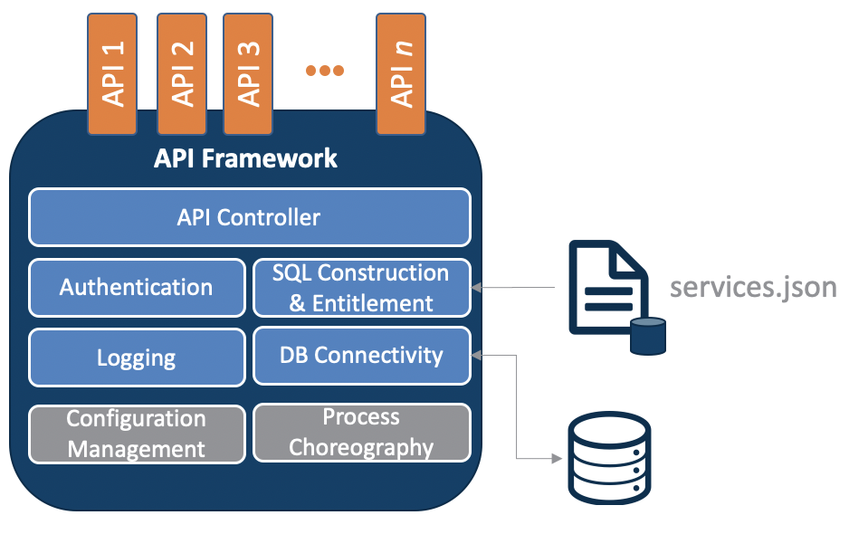

This diagram shows the functionality abstracted out and available for APIs to be plugged in.  As mentioned, the API framework enables RESTful API to be created and run against backend relational tables with no coding required.  It can connect to multiple backend sources and perform RESTful data retrievals from tables, views, or extend the APIController class to run an SQL template with 0 to many substitution values, each that can have default values to aggregate and consolidate data, join across multiple tables or views, or whatever is needed.  The framework also handles the mundane task of authentication, entitlement, logging, database connectivity, and SQL construction based on the SQL template, substitution variables, default values, and entitlement SQL injection.

The solution supports both standard RESTful data access and configurable services. Standard RESTful data access services are configured directly into the API Connect server using either the design tool or command line interface (CLI). Configurable services are those that can be expressed as simple or complex SQL structures with substitution parameters. These will not require coding or deployment; just that its configuration is captured within an in-memory database that stores the services meta-data. This in-memory database runs on the API Connect server and is exposed through the API Connect model, Service. An authorized user can use standard RESTful data access services to populate the meta-data (e.g. PUT, POST, and DELETE). The meta-data can also be edited directly in the `services.json` file, where the in-memory database is persisted.

<a id="2.1"></a>

### Component Architecture

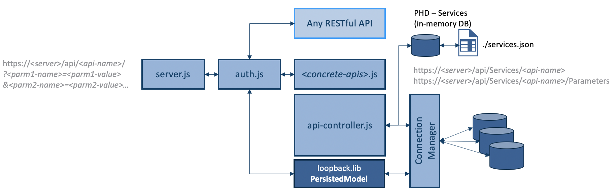

The diagram above show the core components of the framework.  

The `server.js` component is the main entry point to the framework.  Its main responsibility is to either route the request to authentication and entitlement (`/auth/login`) or the API for authenticated users.

The `auth.js` component verifies the access and request token for returning users and/or interfaces with IBM Single Sign-on for new users or users with expired tokens.  Along with authentication, this component retrieves and stores entitlement information and manages the end users “Terms & Conditions” acceptance.

**Note** `auth.js` has been removed for this sandbox, simply because SSO will not route back to “localhost”.

The `api-controller.js` component is the base for all APIs which builds, submits, gathers, and returns the JSON formatted results of the API call.  It is built upon or subclasses the Loopback `PersistedModel` class.  Users of the framework can create a model (by subclassing the `PeristedModel` class) that overlays an individual table or view to RESTfully retrieve data for any connected database **and/or** they can create a model that subclass api-controller to specify simple or complex SQL, of completely arbitrary complexity, that joins multiple tables, aggregates data, whatever.  And, each of these SQL statements can contain 0 to many substitution variables, where each substitution variable can be specified as mandatory or optional and contain default values (thus making a mandatory parameter optional).

Finally, there is a **connection manager** that manages the connections to whatever backend sources you define.


<a id="2.2"></a>

### Object Model

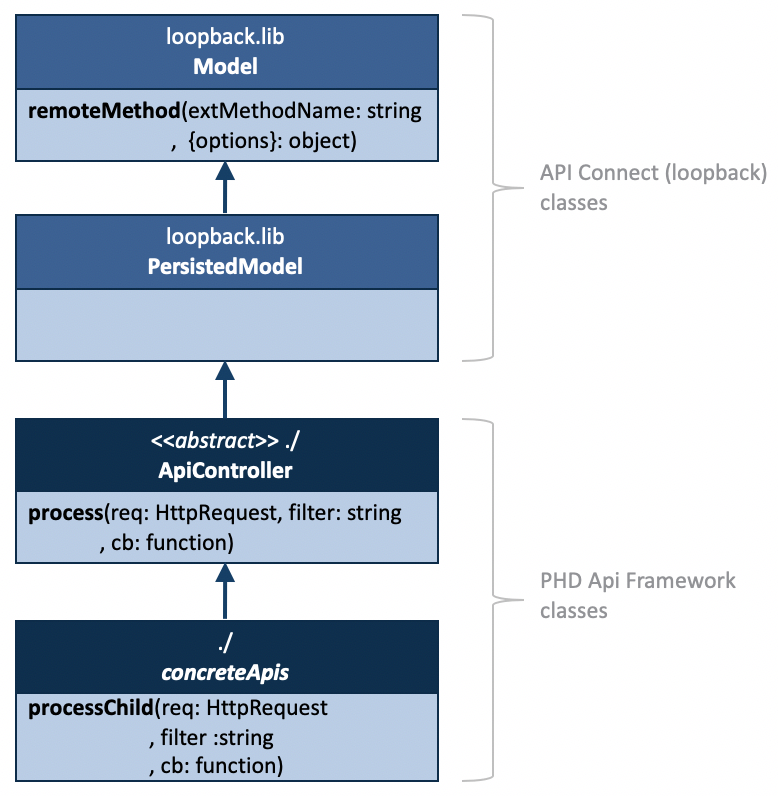

The diagram above shows the object model for the classes that handle data access.

`Model` is the base object in **Loopback**. It contains the `remoteMethod()` method that API Framework uses to execute APIs that require complex SQL.

`PersistedModel` extends `Model` with basic query and CRUD support. It is the base class for models connected to persistent data sources such as databases and is also the base class for all built-in models. It provides all the standard create, read, update, and delete (CRUD) operations and exposes REST endpoints for them. When using the `PersistedModel` to access a relational source, users must configure the Model instance data within a separate JSON file. 

For example the Service table contains the `serviceName` (primary key, "id":true), `sqlTemplate`, `targetModelName`, and `description` and is a parent table of `Parameters` with the foreign key being `serviceName`. Since both the api/Services and api/Services/<service-name>/Parameters APIs extent the `PersistedModel`, they contain their table structure in a `service.json` and `parameters.json` file, respectively.

<a id="2.3"></a>

### Where is the framework running today?

Today the API Framework is being used in the Project Health Dashboard (PHD, ), Practice Leader Dashboard (PLD, ) but it is also being used (in a non-production environment) for WF360 Vortex feed, Chasey Bots, and SCORE.

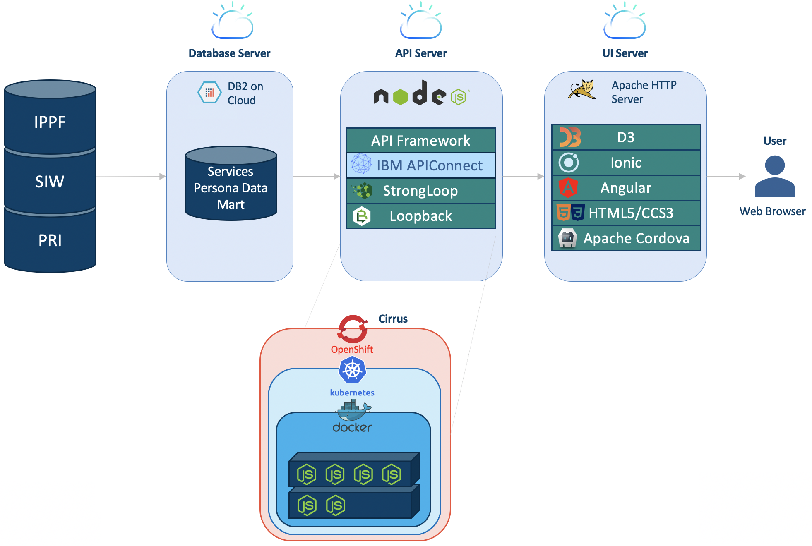

The diagram above shows the PHD environment today.  The API Framework is deployed on an API Server that sits between the application and the data.  You’ll also notice that the framework is deployed in a **Docker** container, that can, and is, running as a microservice that is controlled by **Kubernetes**, running under **OpenShift** on **Cirrus**.

<a id="2.4"></a>

### The Future - API Economy

Where we would like to see it go is to be a linchpin in an API Economy where the framework is a conduit between the application, regardless of what it is written in or where it is running, and the data.  Note that although the diagram is showing the data residing within the **Cognitive Enterprise Data Platform** (**CEDP**); it really can reside anywhere.

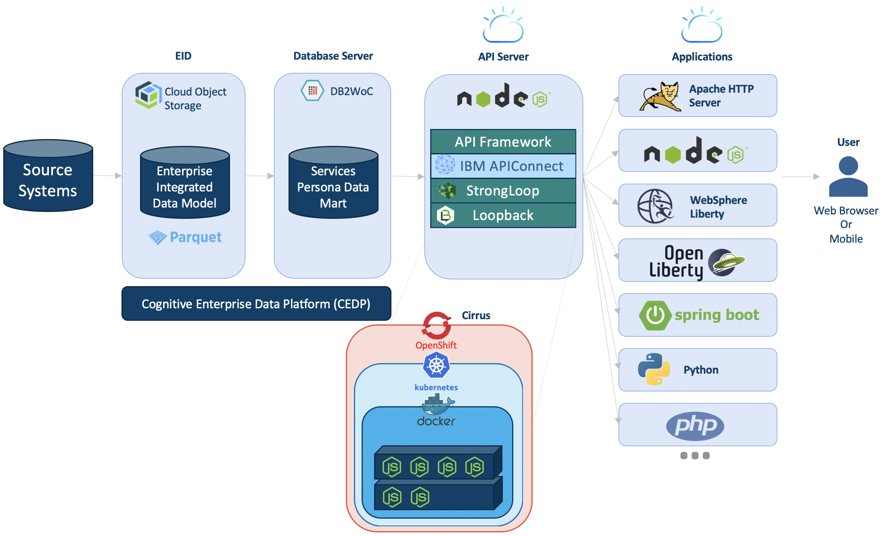

<a id="3.0"></a>

## Running API Framwork Test Environment

This repository contains a self-contained sandbox for the API Framework.  

This sandbox solution also includes setting up and running an instance of Db2 in a Docker container and using Flyway, also run from a Docker, to create and populate a database schema.  See [https://github.ibm.com/IBM-Services-WFM/flyway-docker-db-migration](https://github.ibm.com/IBM-Services-WFM/flyway-docker-db-migration) which contains detailed instructions for creating this container Db2 environment and populating it using Flyway.

Assuming you have set up and populated our Db2 instance and schema in a Docker container, we’ll set up the local API Framework sandbox. 

<a id="3.1"></a>

### Setup

This GitHub repository is a self-contained sandbox for the API Framework, including a `package.json` file that will be used to install and build the environment. To get up and running you'll need:

**1** Install **Node.js** (includes **Node Package Manager (NPM)**) 
[https://nodejs.org/en/download/](https://nodejs.org/en/download/)

**2.** (Optional) Install **Microsoft Visual Studio Code** with C++ Extension
[https://code.visualstudio.com/download](https://code.visualstudio.com/download)

Once you have Node.js installed, you’ll also need a C++ compiler installed, since the installation of the ODBC Db2 drivers, that is part of the NPM Install process, requires it.  Although you can do this many different ways, I found that the easiest way as an extension within Visual Studio Code, which I prefer to Eclipse or Atom for developing Node.js code.

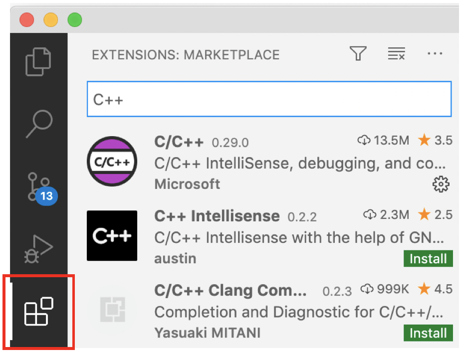

**3.** Clone or download this GitHub repository

**4.** Change your directory into the cloned or downloaded `api-framework` directory and Install the API Framework by simply entering 

```shell
npm install
```
The Node Package Manager will use the `package.json` file to install everything the framework needs, including C++ compiling the Db2 ODBC drivers locally, that is, in the `/node_modules/` subdirectory of the api-framework directory.

**5.** Optionally, if you want to connect a Db2 instance running on the zOS, and in this example, this is the BMSIW, you’ll need to copy the Db2 zOS license into the IBM_DB package’s license sub-directory.  If run as a container, this copy can, and would be, done as part of the container build process.

Copy `cert-dev/db2consv_t.lic` to the license directory in Node’s Db2 module 
```
/node_modules/ibm_db/installer/clidriver/license
```

**6.** Start the server
```shell
node server/server.js
```

<a id="3.2"></a>

### Database Schema

Before continuing, the diagram below shows the database schema, created by the Flyway migration, that we'll be using.

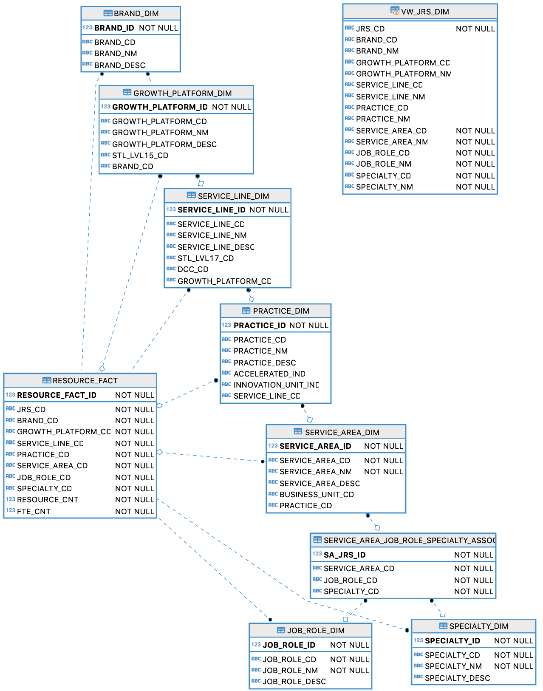

<a id="3.3"></a>

### Sample APIs

To test the API Framework's setup, a datasource to the Docker container Db2 instance has been defined in `server/datasource.json` and the `EDS.VW_JRS_DIM` view has been defined as a model, subclassing the `PersistedModel` in the `common/models` folder (`vw_jrs_dim.json`).

With just this configuration, the following (subset) of APIs are immediately available:

**All JRSs**  
[http://localhost:3000/api/VW_JRS_DIM/](http://localhost:3000/api/VW_JRS_DIM/)
 
**Count**  
[http://localhost:3000/api/VW_JRS_DIM/count](http://localhost:3000/api/VW_JRS_DIM/count)
 
**Specific JRS**  
[http://localhost:3000/api/VW_JRS_DIM/40632-S0390](http://localhost:3000/api/VW_JRS_DIM/40632-S0390)
 
**All JRSs for the Cloud Application Innovation Growth Platform by Name**  
[http://localhost:3000/api/VW_JRS_DIM/?filter[where][GROWTH_PLATFORM_NM]=Cloud%20Application%20Innovation](http://localhost:3000/api/VW_JRS_DIM/?filter[where][GROWTH_PLATFORM_NM]=Cloud%20Application%20Innovation)
 
**All JRSs for the Cloud Application Innovation Growth Platform by Code**  
[http://localhost:3000/api/VW_JRS_DIM/?filter[where][GROWTH_PLATFORM_CD]=15CAI](http://localhost:3000/api/VW_JRS_DIM/?filter[where][GROWTH_PLATFORM_CD]=15CAI)
 
**All JRSs for specific Service Area Code**  
[http://localhost:3000/api/VW_JRS_DIM/?filter[where][SERVICE_AREA_CD]=SI](http://localhost:3000/api/VW_JRS_DIM/?filter[where][SERVICE_AREA_CD]=SI)
 
**All JRSs for Service Area Name beginning with DXX**  
[http://localhost:3000/api/VW_JRS_DIM/?filter[where][SERVICE_AREA_NM][like]=DXX%](http://localhost:3000/api/VW_JRS_DIM/?filter[where][SERVICE_AREA_NM][like]=DXX%)
 
**All JRSs for specific Service Area Code or Service Area Name beginning with DXX**  
[http://localhost:3000/api/VW_JRS_DIM/?filter[where][or][0][SERVICE_AREA_CD]=SI&filter[where][or][1][SERVICE_AREA_NM][like]=DXX%](http://localhost:3000/api/VW_JRS_DIM/?filter[where][or][0][SERVICE_AREA_CD]=SI&filter[where][or][1][SERVICE_AREA_NM][like]=DXX%)
 
**... Ordered by Service Area Name in descending order**  
[http://localhost:3000/api/VW_JRS_DIM/?filter[where][or][0][SERVICE_AREA_CD]=SI&filter[where][or][1][SERVICE_AREA_NM][like]=DXX%&filter[order][0]=SERVICE_AREA_CD%20DESC](http://localhost:3000/api/VW_JRS_DIM/?filter[where][or][0][SERVICE_AREA_CD]=SI&filter[where][or][1][SERVICE_AREA_NM][like]=DXX%&filter[order][0]=SERVICE_AREA_CD%20DESC)
 
**... Ordered by Service Area Name in descending order and Job Role Name**  
[http://localhost:3000/api/VW_JRS_DIM/?filter[where][or][0][SERVICE_AREA_CD]=SI&filter[where][or][1][SERVICE_AREA_NM][like]=DXX%&filter[order][0]=SERVICE_AREA_CD%20DESC&filter[order][1]=JOB_ROLE_NM](http://localhost:3000/api/VW_JRS_DIM/?filter[where][or][0][SERVICE_AREA_CD]=SI&filter[where][or][1][SERVICE_AREA_NM][like]=DXX%&filter[order][0]=SERVICE_AREA_CD%20DESC&filter[order][1]=JOB_ROLE_NM)
 
<a id="4.0"></a>

## Create API based on Persisted Model

Now that we have the API Framework up and running, we'll shut it down (`<control>+c`) and create a new API based on the `PersistedModel`.

**1.** Start the API Connect - API Designer using the command:

```shell
apic edit
```

**2.** Sign in (using IBM's SSO + IBM Verify)   
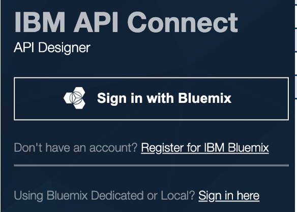

**3.** Go to Models -> Add   
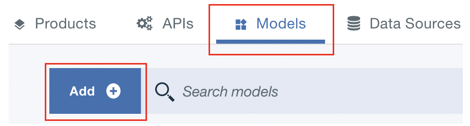 Add" width="39%"/>

**4.** Specify name, base model (superclass), datasource, properties, and save  
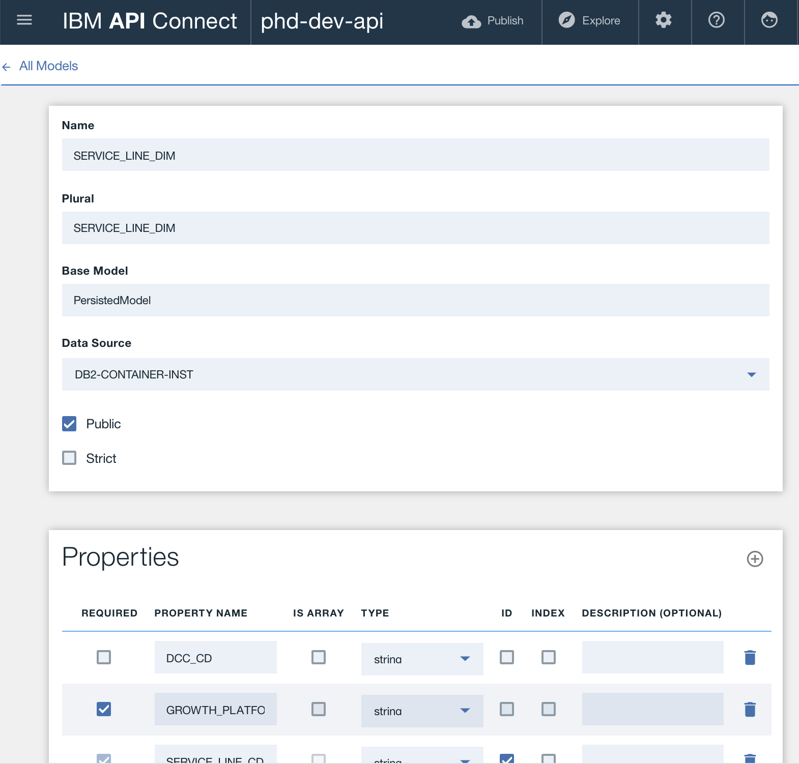

**5.** Restart the API Server  

```shell
node server/server.js
```

**6.** Try out some APIs  

**All Service Lines**  
[http://localhost:3000/api/SERVICE_LINE_DIM/](http://localhost:3000/api/SERVICE_LINE_DIM/)
 
**Count**  
[http://localhost:3000/api/SERVICE_LINE_DIM/count](http://localhost:3000/api/SERVICE_LINE_DIM/count)
 
**Specific Service Line**  
[http://localhost:3000/api/SERVICE_LINE_DIM/17CBD](http://localhost:3000/api/SERVICE_LINE_DIM/17CBD)

**Service Lines for a specific growth plaform**  
[http://localhost:3000/api/SERVICE_LINE_DIM/?filter[where][GROWTH_PLATFORM_CD]=15CAI](http://localhost:3000/api/SERVICE_LINE_DIM/?filter[where][GROWTH_PLATFORM_CD]=15CAI)
 
**Service Lines for a specific legacy level 17 code**  
[http://localhost:3000/api/SERVICE_LINE_DIM/?filter[where][STL_LVL17_CD]=MAN](http://localhost:3000/api/SERVICE_LINE_DIM/?filter[where][STL_LVL17_CD]=MAN)